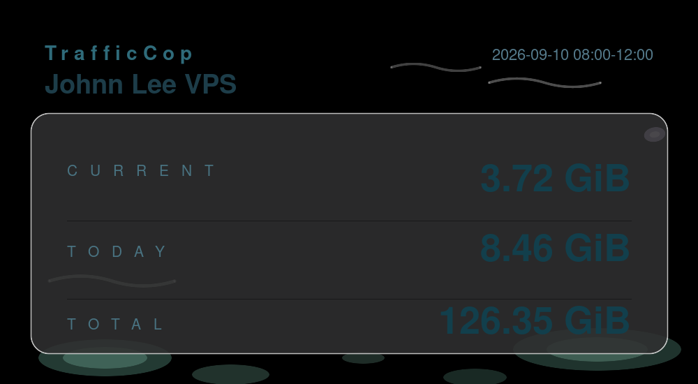

# TrafficCop

TrafficCop 是一个轻量的 VPS 流量统计脚本。它使用 `vnStat` 每小时记录一次上传与下载流量之和，并在指定的北京时间向 Telegram 推送图片卡片。

## 功能

- 图片只展示统计区间总流量、今日累计和安装后累计，不显示上下行明细
- 自定义每天的推送时间，多个整点之间的流量自动合并
- 可选北京时间 00:00 的每日总结
- 自动保存统计状态和小时历史，升级时保留已有数据
- 支持使用 `apt`、`dnf` 或 `yum` 的主流 Linux 发行版

## 推送效果



## 部署

准备好 Telegram Bot Token 和接收消息的 Chat ID，然后使用 `root` 用户运行：

```bash
bash <(curl -fsSL https://raw.githubusercontent.com/Johnn-Lee/vpstraffic/main/trafficcop-manager.sh) --install
```

安装程序会自动安装依赖，并依次询问：

1. Bot Token 和 Chat ID
2. 需要统计的网卡与机器名称
3. 是否开启每日总结
4. 每天需要推送的北京时间，例如 `8 12 20`

安装完成后，脚本位于 `/root/TrafficCop/trafficcop.sh`。定时任务会在每个整点采集流量，只在配置的时间发送图片。

再次执行上面的安装命令即可更新脚本，现有配置和统计数据不会被清除。

## 常用命令

```bash
/root/TrafficCop/trafficcop.sh                  # 打开管理菜单
/root/TrafficCop/trafficcop.sh --status         # 查看配置和累计流量
/root/TrafficCop/trafficcop.sh --history        # 查看最近 25 条记录
/root/TrafficCop/trafficcop.sh --test-telegram  # 发送一张测试图片
/root/TrafficCop/trafficcop.sh --run            # 立即采集一次
```

配置、状态和历史记录保存在 `/root/TrafficCop/`。统计及推送时区固定为 `Asia/Shanghai`。
